<!-- ============================================================
     GitHub Profile README — Senuka Deneth
     Animated · Teal / Cyan AI aesthetic
     ============================================================ -->

  

   

  

    

  
  &nbsp;
  
  &nbsp;
  

 

 

## About Me

  

 

Hey — I'm **Senuka**, an AI undergraduate at the **University of Moratuwa** pursuing a BSc (Hons) in Artificial Intelligence. I build agents, RAG systems, and ML-powered products — turning research ideas into things people can actually use.

**Right now I'm deep into:**
- Designing **AI agents** and intelligent workflows
- Shipping **LLM / Generative AI** applications with grounded RAG
- Exploring **deep learning** architectures end-to-end
- Crafting full-stack experiences around AI systems

  

## Tech Stack

  

 

  
  
  
  
  
  

## Featured Projects

<table>
  <tr>
    <td width="50%" valign="top">
      <h3><a href="https://github.com/Senuka-Deneth/Clean-RAG-Application-Flask">Clean RAG · Flask</a></h3>
      
Local RAG app with Ollama LLMs — grounded answers with citations from uploaded docs, plus a Flask UI.

      

        
        
        
        
      

    </td>
    <td width="50%" valign="top">
      <h3><a href="https://github.com/Senuka-Deneth/Clean-RAG-Application-Gradio">Clean RAG · Gradio</a></h3>
      
Same grounded RAG pipeline, reimagined with a Gradio interface for fast experimentation and demos.

      

        
        
        
      

    </td>
  </tr>
  <tr>
    <td width="50%" valign="top">
      <h3><a href="https://github.com/Senuka-Deneth/Sonar-Code-Editor">Sonar Code Editor</a></h3>
      
Privacy-focused coding environment for students — admin-configurable completion, tags, and assistance tools for supervised / exam settings.

      

        
        
      

    </td>
    <td width="50%" valign="top">
      <h3><a href="https://github.com/Senuka-Deneth/StairDOC">StairDOC · Robotics</a></h3>
      
Stair-climbing robot with algorithmic motion control — mechanics, systems integration, and problem-solving in the real world.

      

        
        
      

    </td>
  </tr>
  <tr>
    <td width="50%" valign="top">
      <h3><a href="https://github.com/Senuka-Deneth/SmartWeighingMachine">Smart Weighing Machine</a></h3>
      
Intelligent weighing system built with TypeScript — sensing, logic, and a practical product surface.

      

        
        
      

    </td>
    <td width="50%" valign="top">
      <h3><a href="https://github.com/Senuka-Deneth/spring-boot-crud">Spring Boot CRUD API</a></h3>
      
Student CRUD REST API with Maven — clean Spring Boot foundations for backend services.

      

        
        
      

    </td>
  </tr>
</table>

## Learning Path

Completed training from:

| Platform | Focus |
| :-- | :-- |
| **DeepLearning.AI** | Advanced AI courses |
| **IBM** | Machine Learning specialization |
| **Coursera** | Professional development |
| **CodeSignal** | Algorithm training |

**Foundations I lean on:** Linear Algebra · Vector Spaces & Eigenvectors · Probability & Statistics · Deep Learning · LLM architecture · RAG design

## GitHub Analytics

  
  

   

  

   

  

    

  

## Contribution Snake

  <!-- Falls back gracefully until the Action first publishes to the `output` branch -->
  <picture>
    <source media="(prefers-color-scheme: dark)" srcset="https://raw.githubusercontent.com/Senuka-Deneth/Senuka-Deneth/output/github-contribution-grid-snake-dark.svg" />
    <source media="(prefers-color-scheme: light)" srcset="https://raw.githubusercontent.com/Senuka-Deneth/Senuka-Deneth/output/github-contribution-grid-snake.svg" />
    
  </picture>

## Education

**University of Moratuwa** — BSc (Hons) in Artificial Intelligence  
Currently Semester 2 · Focus: ML, DL, AI systems, and mathematical foundations

## Goals

1. **Master AI Engineering** — deep expertise in agents and intelligent systems  
2. **Build Real Products** — ship tangible AI tools people rely on  
3. **Start an AI Business** — create lasting value through entrepreneurship  
4. **Keep Growing** — discipline, learning, and deliberate practice

## Connect

  
  &nbsp;
  

    

  

---

  Designed with animated SVGs · auto-updating stats · contribution snake

